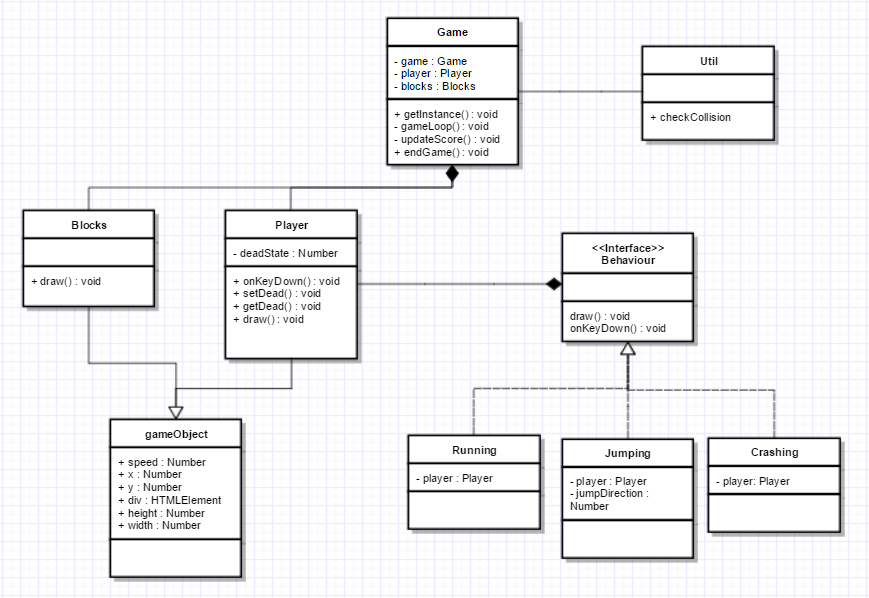

Installatie:
Typescript game die gebruik maakt van een singleton, een static utils class, een interface en strategy patterns.
Assesser kan een fork maken en deze pullen om lokaal de ts files te compilen naar js Vervolgens zullen deze in de docs folder te vinden
zijn om te runnen in de browser.

Interface:
Het bestand: Behaviour.ts, bevat een interface waar alle Behaviours gebruik van maken. Deze interface heeft maar 2 methods, een draw en 
een onkeydown. Draw is de gebruikte method om alle functionaliteiten mee te geven aan een Behaviour. Onkeydown wordt gebruikt om 
interactie met de gebruiker te creeëren. 

Static utility method:
Het util.ts bestand bevat 1 static method, checkCollision. Deze method wordt in game.ts aangeroepen om te kijken of er 2
gameObjects in contact komen met elkaar. Dit is een return functie die een true of false mee geeft.

Singleton:
Game.ts is de singleton. Op regel 25 van game.ts wordt de getInstance method aangemaakt voor het gebruik van de Singleton.
Op regel 72 van game.ts wordt de game aangemaakt mbv de singleton. Het 2e gebruik van de singleton is te
vinden in crashing.ts. Hier wordt de endGame method aangeroepen vanuit game.ts.

Strategy:
Zoals hierboven al is genoemd, de interface is behaviour.ts. Hier aan vast zitten crashing, jumping en running. Deze 3 zijn 
geïmplementeerd zoals we dat in de les hebben behandeld. In player.ts wordt 1 maal de variabele met behaviour gevuld door 
running.ts. Vervolgens wordt er 1 keer de functie draw aangeroepen die in de gameloop staat. Hierdoor kunnen de rest van
de behaviours aangroepen worden.

Encapsulation, Composition, Inheritance:
gameObject.ts is een class. behaviour.ts is een interface. gameObject.ts extend player.ts en block.ts. Deze 2 krijgen alle basis
functionaliteiten en gegevens van gameObject.ts. Player en block zijn dus gameObjects. Dit geldt ook voor alle behaviours,
Jumping, Running en Crashing zijn behaviours.
Game.ts maakt een player en een brick aan, game heeft dus een player en een brick.
Encapsulation wordt vrijwel in elk object gebruikt. Player heb ik 1 private variabele gegeven, deadState. Deze heeft een
get en set functie om aan te passen. Vooral Game heeft veel private methods en variabelen. Dit is ook omdat er weinig andere
objecten iets van game hoeven te weten. De rest van de classes daarentegen hebben wel veel op public staan, juist zodat
Game erbij kan.

# Peer review - Wilco van Dijk
Block.ts en Player.ts hebben beide een public draw functie. Ze extenden allebei van gameObject. Dan kan je de draw functie ook in gameobject plaatsen. Als je meerdere gaat toevoegen hoeft ie niet steeds in de class te staan. Als ie toch iets anders moet doen kan je de functie altijd nog overschrijven.

Als je de draw functie in gameObject hebt staan kan je ook de properties width en height in gameobject zetten en niet apart in block.ts en player.ts. Dan kan je de height en width meegeven in de super().

In de interface staat niet de property player. Misschien handig om dit wel in de interface te plaatsen waardoor het verplicht wordt om player mee te geven. Zo kan je altijd player aanroepen in de behaviour.

Het is nu dat je bij elke keypress de player laat springen. Misschien een check op welke key er wordt gedrukt zodat je als speler niet verrast wordt als je perongeluk een key indrukt. Dat alleen de speler springt bij een spatie klik.

De utils class ziet er goed uit. slim om gameobject te gebruiken. Zo kan je elk object wat gameobject extend daarvoor gebruiken.
